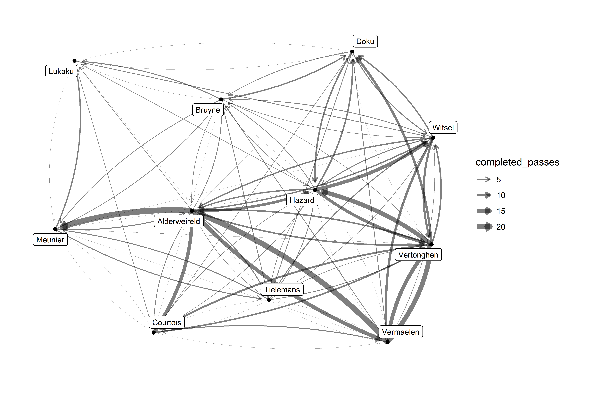
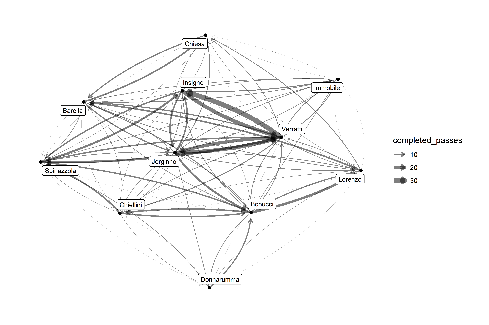

<!-- README.md is generated from README.Rmd. Please edit that file -->

# Euro2020PassNetworks

<!-- badges: start -->
<!-- badges: end -->

This package provides UEFA Euro 2020 data, primarily focused on passing
data.

## Installation

You can install the development version of Euro2020PassNetworks

``` r
require(remotes)
remotes::install_github("SinanPolatoglu/Euro2020PassNetworks")
```

## Data

There are two datasets included:

1.  `MatchSummaries`: data frame overview stats for each match
2.  `PassNetwork`: data frame containing `igraph` directed passing
    networks

``` r
library(Euro2020PassNetworks)
MatchSummaries
#> # A tibble: 51 x 15
#>    matchday date       home    away    sc_home sc_away had_penalties sc_pen_home
#>       <dbl> <date>     <chr>   <chr>     <dbl>   <dbl> <lgl>               <dbl>
#>  1        1 2021-06-11 Turkey  Italy         0       3 FALSE                  NA
#>  2        1 2021-06-12 Belgium Russia        3       0 FALSE                  NA
#>  3        1 2021-06-12 Denmark Finland       0       1 FALSE                  NA
#>  4        1 2021-06-12 Wales   Switze~       1       1 FALSE                  NA
#>  5        1 2021-06-13 Nether~ Ukraine       3       2 FALSE                  NA
#>  6        1 2021-06-13 Austria North ~       3       1 FALSE                  NA
#>  7        1 2021-06-13 England Croatia       1       0 FALSE                  NA
#>  8        1 2021-06-14 Spain   Sweden        0       0 FALSE                  NA
#>  9        1 2021-06-14 Poland  Slovak~       1       2 FALSE                  NA
#> 10        1 2021-06-14 Scotla~ Czech ~       0       2 FALSE                  NA
#> # ... with 41 more rows, and 7 more variables: sc_pen_away <dbl>,
#> #   pos_home <dbl>, pos_away <dbl>, total_shots_home <dbl>,
#> #   total_shots_away <dbl>, shots_on_target_home <dbl>,
#> #   shots_on_target_away <dbl>
```

``` r
PassNetworks
#> # A tibble: 51 x 4
#>    home        away            home_graph away_graph
#>    <chr>       <chr>           <list>     <list>    
#>  1 Turkey      Italy           <igraph>   <igraph>  
#>  2 Belgium     Russia          <igraph>   <igraph>  
#>  3 Denmark     Finland         <igraph>   <igraph>  
#>  4 Wales       Switzerland     <igraph>   <igraph>  
#>  5 Netherlands Ukraine         <igraph>   <igraph>  
#>  6 Austria     North Macedonia <igraph>   <igraph>  
#>  7 England     Croatia         <igraph>   <igraph>  
#>  8 Spain       Sweden          <igraph>   <igraph>  
#>  9 Poland      Slovakia        <igraph>   <igraph>  
#> 10 Scotland    Czech Republic  <igraph>   <igraph>  
#> # ... with 41 more rows
```

## Usage

Two helper functions are included to obtain lists of `igraph` objects:

-   `passes_by_match`
-   `passes_by_team`

``` r
bel_ita = passes_by_match('Belgium', 'Italy')
str(bel_ita, max.level = 1)
#> List of 2
#>  $ Belgium:List of 10
#>   ..- attr(*, "class")= chr "igraph"
#>  $ Italy  :List of 10
#>   ..- attr(*, "class")= chr "igraph"
```

``` r
ita = passes_by_team('Italy')
str(ita, max.level = 1)
#> List of 7
#>  $ Turkey     :List of 10
#>   ..- attr(*, "class")= chr "igraph"
#>  $ Switzerland:List of 10
#>   ..- attr(*, "class")= chr "igraph"
#>  $ Wales      :List of 10
#>   ..- attr(*, "class")= chr "igraph"
#>  $ Austria    :List of 10
#>   ..- attr(*, "class")= chr "igraph"
#>  $ Belgium    :List of 10
#>   ..- attr(*, "class")= chr "igraph"
#>  $ Spain      :List of 10
#>   ..- attr(*, "class")= chr "igraph"
#>  $ England    :List of 10
#>   ..- attr(*, "class")= chr "igraph"
```

Each `igraph` object is a directed graph of completed passes during a
match with several node attributes on passing statistics. See
`help("PassNetworks")` for details.

``` r
bel_ita$Belgium
#> IGRAPH 90461e0 DN-- 14 97 -- 
#> + attr: name (v/c), mins_played (v/n), pc_long (v/n), pa_long (v/n),
#> | pc_medium (v/n), pa_medium (v/n), pc_short (v/n), pa_short (v/n),
#> | pc_total (v/n), pa_total (v/n), pass_accuracy_total (v/n),
#> | completed_passes (e/n)
#> + edges from 90461e0 (vertex names):
#>  [1] Thibaut Courtois ->Toby Alderweireld Thibaut Courtois ->Thomas Vermaelen 
#>  [3] Thibaut Courtois ->Jan Vertonghen    Thibaut Courtois ->Kevin De Bruyne  
#>  [5] Thibaut Courtois ->Youri Tielemans   Thibaut Courtois ->Romelu Lukaku    
#>  [7] Thibaut Courtois ->Thomas Meunier    Thibaut Courtois ->Thorgan Hazard   
#>  [9] Thibaut Courtois ->Jeremy Doku       Toby Alderweireld->Thibaut Courtois 
#> + ... omitted several edges
```

In combination with R’s network analysis libraries, these passing
networks can be interesting to get acquainted with network analysis.

``` r
require(ggraph)
require(igraph)

G1 = bel_ita$Belgium
G2 = bel_ita$Italy

G1 = igraph::delete.vertices(G1, V(G1)$mins_played <= 70)
G2 = igraph::delete.vertices(G2, V(G2)$mins_played <= 70)

visualise_passes = function(G){
  set.seed(2020)
  ggraph(G, layout = 'fr')+
  geom_edge_fan(
    aes(width=completed_passes), arrow = arrow(length = unit(2, 'mm')), 
    end_cap = circle(3, 'mm'), alpha = .5
  )+
  scale_edge_width(range = c(.1, 3))+
  geom_node_point()+
  geom_node_label(aes(label=gsub('[[:alpha:]]+ ', '', name)), size=3, repel = TRUE) +
  theme_graph()
}

visualise_passes(G1)
```



``` r
visualise_passes(G2)
```


